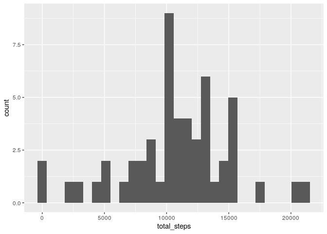
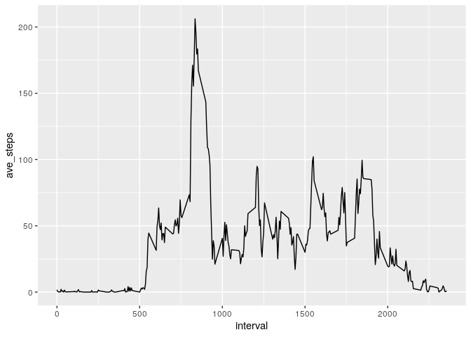
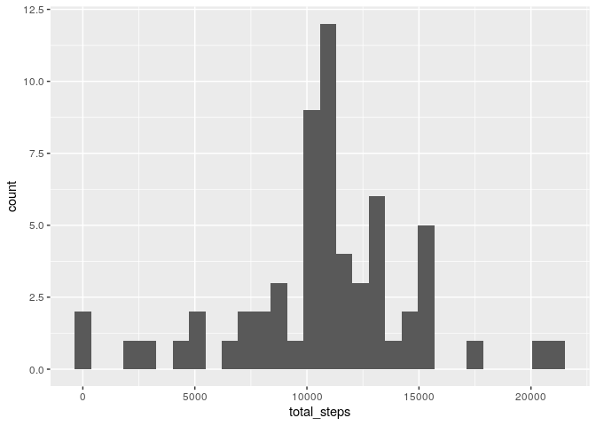
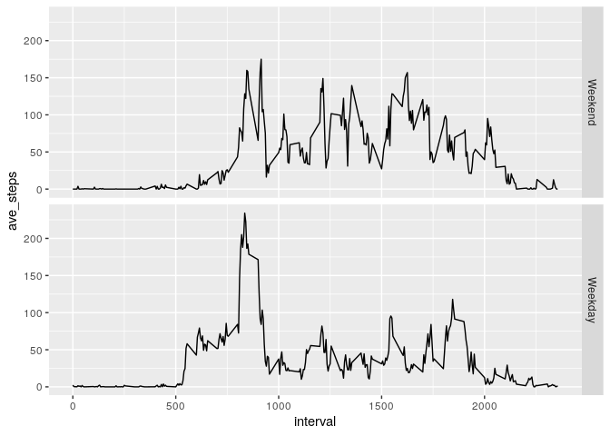

This document is a submission for the reproducible research peer assessment 1.


We load two useful libraries. `tidyverse` for dataframe manipulations which also contains `ggplot2` for plotting.


```r
library(tidyverse)
```

```
## ── Attaching packages ─────────────────────────────────────────────────────────── tidyverse 1.3.0 ──
```

```
## ✓ ggplot2 3.3.2     ✓ purrr   0.3.4
## ✓ tibble  3.0.3     ✓ dplyr   1.0.2
## ✓ tidyr   1.1.2     ✓ stringr 1.4.0
## ✓ readr   1.3.1     ✓ forcats 0.5.0
```

```
## ── Conflicts ────────────────────────────────────────────────────────────── tidyverse_conflicts() ──
## x dplyr::filter() masks stats::filter()
## x dplyr::lag()    masks stats::lag()
```


## Loading and preprocessing the data

We upzip and load the data in the repo into a dataframe.


```r
unzip("activity.zip", exdir = '.')
df = read.csv("activity.csv")
```


## What is mean total number of steps taken per day?

We create a dataframe that is groups the data by day, and calculates step average for each day.

```r
steps_by_date = df %>%
  drop_na() %>%
  group_by(date) %>%
  summarise(total_steps=sum(steps))
```

```
## `summarise()` ungrouping output (override with `.groups` argument)
```

We create a histogram of the average steps per day.

```r
ggplot(data=steps_by_date, aes(total_steps)) + geom_histogram()
```

```
## `stat_bin()` using `bins = 30`. Pick better value with `binwidth`.
```

<!-- -->
We calculate the mean and median as requested.

```r
mean(steps_by_date$total_steps, na.rm=TRUE)
```

```
## [1] 10766.19
```

```r
median(steps_by_date$total_steps, na.rm=TRUE)
```

```
## [1] 10765
```

## What is the average daily activity pattern?

We extract the data from the dataframe for the each interval, and the average steps across all days.

```r
ave_steps_interval = df %>% 
  drop_na() %>%
  group_by(interval) %>%
  summarise(ave_steps=mean(steps))
```

```
## `summarise()` ungrouping output (override with `.groups` argument)
```

We create a time series plot of each 5 minuite interval vs average steps across all days (within that interval).

```r
ggplot(ave_steps_interval, aes(interval, ave_steps)) + geom_line()
```

<!-- -->

We compute the interval with the most steps across all days.

```r
max_index = which.max(ave_steps_interval$ave_steps)
ave_steps_interval$interval[max_index]
```

```
## [1] 835
```
The interval 835 has the most number of steps across all days with the following value.

```r
ave_steps_interval$ave_steps[max_index]
```

```
## [1] 206.1698
```

## Imputing missing values

We calculate the number of missing values as requested.

```r
sum(is.na(df))
```

```
## [1] 2304
```

We create a datafame that is the average across all days for each interval.
We intend to use this dataframe to fill in the missing values.
As such, we set the rownames to be the `interval` column.

```r
interval_step_ave = df %>% 
  drop_na() %>%
  group_by(interval) %>%
  summarise(ave_steps=mean(steps)) %>%
  column_to_rownames(var="interval")
```

```
## `summarise()` ungrouping output (override with `.groups` argument)
```

We make a copy of the original dataframe.

```r
df_filled = data.frame(df)
```

We fill in the missing values in the copied dataframe with the associated average for that rows interval label.

```r
# fill the data with the average number of steps taken (across all days) for that
# given hour
na_mask = is.na(df$steps)
df_filled[na_mask,]$steps = interval_step_ave[as.character(df[na_mask,]$interval),]
```

Based of the copied and filled dataframe, we create a new dataframe that is the average steps taken per day.

```r
steps_by_date_filled = df_filled %>%
  drop_na() %>%
  group_by(date) %>%
  summarise(total_steps=sum(steps))
```

```
## `summarise()` ungrouping output (override with `.groups` argument)
```

We then plot the histogram of the steps averages (based off the filled database).

```r
ggplot(data=steps_by_date_filled, aes(total_steps)) + geom_histogram()
```

```
## `stat_bin()` using `bins = 30`. Pick better value with `binwidth`.
```

<!-- -->

We now calculate the `mean` and `median` of this new dataframe as requested.

```r
mean(steps_by_date_filled$total_steps, na.rm=TRUE)
```

```
## [1] 10766.19
```

```r
median(steps_by_date_filled$total_steps, na.rm=TRUE)
```

```
## [1] 10766.19
```

## Are there differences in activity patterns between weekdays and weekends?

We add a new column classifying the date as "Weekday" or "Weekend".
We create plots for each of new factor variable.
The subplots are of the average steps across all days over each intervals.

```r
df %>%
  drop_na() %>%
  mutate(
    is_weekend=case_when(
      weekdays(as.Date(date)) == "Saturday" ~ "Weekend",
      weekdays(as.Date(date)) == "Sunday" ~ "Weekend",
      # all other days, classify as a weekday
      TRUE ~ "Weekday",
    ),
    # recalculate is_weekend as a factor variable
    is_weekend=factor(is_weekend, c("Weekend","Weekday"))
  ) %>%
  group_by(interval, is_weekend) %>%
  summarise(ave_steps=mean(steps)) %>%
  ggplot(aes(interval, ave_steps)) + 
    geom_line() +
    facet_grid(is_weekend ~ .)
```

```
## `summarise()` regrouping output by 'interval' (override with `.groups` argument)
```

<!-- -->
